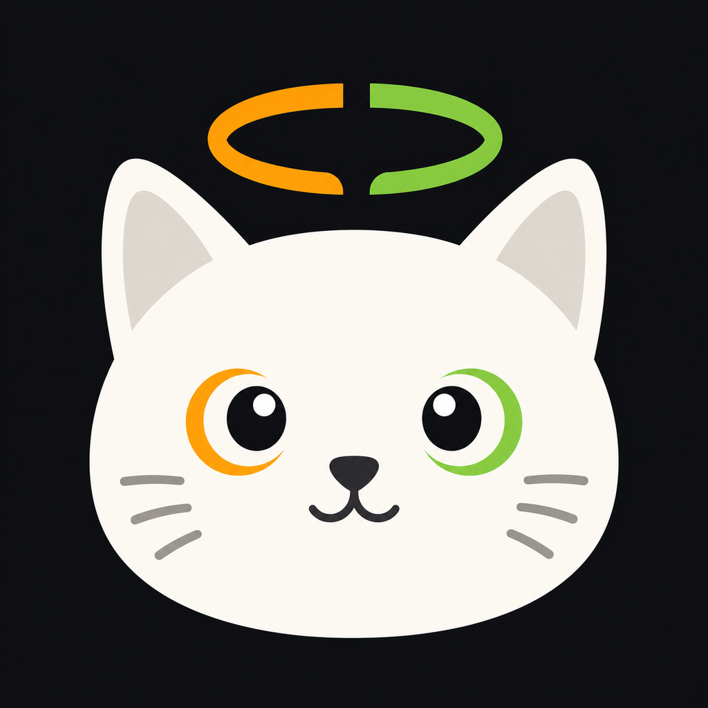

# Agent Halo

<p align="center">
  
</p>

<p align="center">
  A local macOS presence companion for Letta Code — built around the notch, live agent activity, and workspace-aware session recall.
</p>

<p align="center">
  <strong>Local-first</strong> · <strong>Mod-driven</strong> · <strong>Notch-native</strong>
</p>

---

## Overview

Agent Halo is a small desktop companion for [Letta Code](https://docs.letta.com/letta-code/index.md). It runs near the macOS camera notch, listens to trusted Letta Code mod events, and turns agent activity into a compact live presence surface.

It is designed for people who keep multiple Letta Code conversations, subagents, and project terminals open at once. Instead of scraping terminal text or asking you to hunt through panes, Agent Halo keeps recent workspaces visible, shows what is currently happening, and provides lightweight local controls.

## What Agent Halo does

- Shows live Letta Code activity in a compact notch-style overlay.
- Tracks conversation lifecycle, model turns, tool starts/ends, compaction, and local-backend LLM request activity.
- Groups recent sessions by workspace so related subagents stay together.
- Keeps completed sessions visible until you explicitly clear them, with per-session detail and Ghostty focus access inside expandable workspace groups.
- Provides a native Ghostty focus fallback for matching terminal tabs/windows by cwd/title/session hints.
- Shows local AI usage for supported providers when credentials or local usage sources are available.
- Can keep the macOS display awake while current Letta work is actively running, without treating stale or completed sessions as active work.
- Installs and verifies the local Letta Code mod from the desktop setup view.

Agent Halo intentionally stays local. It uses the public Letta Code mod surface, a local bridge, local credentials, and local logs. It does not depend on a hosted dashboard and does not use transcript parsing as its primary source of truth.

## Current status

Agent Halo is an early macOS app. The core bridge, desktop overlay, setup flow, workspace grouping, session controls, mascot activity, and local usage views are active. The project is still evolving quickly; expect the event protocol and native controls to stay conservative until Letta exposes stable public APIs for deeper session/process control.

## Architecture

```text
Letta Code public mod events
  -> ~/.letta/mods/agent-halo.js
  -> local bridge on 127.0.0.1:47621
  -> SSE / snapshot / NDJSON log
  -> Tauri desktop notch overlay + terminal viewer
```

The bridge exposes local-only endpoints:

| Endpoint | Purpose |
| --- | --- |
| `GET /health` | Bridge status and capability metadata |
| `GET /snapshot` | Current capabilities and recent events |
| `GET /events` | Live Server-Sent Events stream |
| `POST /hook/stop` | Optional local Stop-hook bridge for turn completion fallback |
| `POST /hook/attention` | Local PermissionRequest-hook bridge for needs-input activity |
| `POST /ingest` | Multi-instance fan-in when another mod instance already owns the bridge port |

The bridge also writes a local NDJSON event log:

```text
~/.letta/mods/agent-halo.events.ndjson
```

See:

- [`docs/architecture.md`](docs/architecture.md)
- [`docs/event-protocol.md`](docs/event-protocol.md)
- [`docs/presence-model.md`](docs/presence-model.md)

## Event coverage

Agent Halo currently consumes these Letta Code mod events when available:

- `conversation_open`
- `conversation_close`
- `turn_start`
- `tool_start`
- `tool_end`
- `compact_start`
- `compact_end`
- `llm_start`
- `llm_end`
- `turn_complete` from the installed Stop-hook relay
- `attention_requested` from `AskUserQuestion` tool lifecycle when available, or an explicitly connected PermissionRequest/Notification hook

The bridge keeps payloads intentionally small and privacy-aware. Tool results are represented by status and output length, not raw output. LLM activity stores model, stop reason, duration, and token counts. User text previews are disabled by default unless explicitly configured locally.

Lower-level Letta Code app-server/device protocol events such as queue, approval result, and process-control messages are not consumed. Agent Halo uses the supported local `PermissionRequest` hook only to signal that user attention is required; it does not inspect transcript text or claim access to the full internal approval queue.

## Usage providers

The Usage tab keeps every known provider discoverable. Providers Agent Halo can read locally show current metrics; unavailable/offline providers remain visible with the concrete local cause instead of disappearing.

Currently supported local providers:

- Codex
- Antigravity
- Claude Code
- Cursor
- Grok

Notes:

- Codex history and token trends come from local usage history where available.
- Antigravity usage is read from the local Antigravity/`agy` language server using the same quota-summary surface as `/usage`.
- Claude Code follows OpenUsage-informed local credential detection and refresh behavior where possible.
- Provider cards remain capability-aware; credential-present but unusable sessions should surface a status message instead of silently disappearing.

## Installation

### Requirements

- macOS
- Letta Code `0.27.x` or newer recommended
- pnpm `10.x`
- Rust and the Tauri toolchain for desktop builds

### Build and install the desktop app

```bash
pnpm install
pnpm desktop:install
open /Applications/Agent\ Halo.app
```

In Agent Halo, open **Setup** and choose **Install/Reinstall** to install the local Letta mod:

```text
~/.letta/mods/agent-halo.js
```

Then reload Letta Code:

```text
/reload
```

You can also install the mod directly from the repository:

```bash
pnpm mod:install
```

The installer also copies a local hook relay to `~/.letta/hooks/agent-halo-hook.mjs`. It deliberately does **not** rewrite global `~/.letta/settings.json`, so existing voice/safety hooks and concurrent Letta settings writes remain untouched. `AskUserQuestion` is observed directly when its tool lifecycle is available; runtimes that render it outside the local tool manager can connect an existing `Notification` voice hook to the relay. Completion-adjacent notifications are suppressed so ordinary finished turns do not become false needs-input activity. Generic `PermissionRequest` attention remains optional and requires explicitly registering the relay after active Letta sessions are closed.

## Development

Common commands:

```bash
pnpm check              # Typecheck root + desktop
pnpm test:demo          # Browser demo Playwright tests
pnpm desktop:dev        # Run the Tauri desktop app in dev mode
pnpm desktop:install    # Build and install /Applications/Agent Halo.app
pnpm desktop:web        # Browser-only demo/dev server
pnpm viewer             # Terminal SSE viewer
pnpm mod:tail           # Tail the local NDJSON event log
```

Browser-only demo:

```bash
pnpm desktop:web
open http://127.0.0.1:47622/?demo=1
```

The browser demo is useful for layout and interaction checks. Native behavior — mod install, Ghostty focus, menu-bar behavior, transparent window sizing, and real event streams — must be validated in the Tauri desktop app.

## Project layout

```text
mods/agent-halo.js              Letta Code mod and local bridge
packages/protocol/              Shared event and presence model
apps/desktop/                   Tauri desktop notch overlay
apps/viewer/                    Terminal event viewer
docs/                           Architecture, protocol, and design notes
scripts/install-mod.mjs         Local mod installer
scripts/install-desktop.mjs     Desktop build/install helper
```

## Design direction

Agent Halo should feel like a quiet companion, not a generic AI dashboard. The interface follows a dark hardware-notch direction with compact workspace rows, hairline dividers, restrained orange/green state accents, and small mascot activity.

Design references and parity notes live in [`docs/notchcode-parity.md`](docs/notchcode-parity.md).

Runtime mascot strips live in:

```text
apps/desktop/public/mascots/halo-soft-cube/
```

Selected source masters, palette provenance, and QA evidence live in:

```text
apps/desktop/assets/mascots/halo-soft-cube/
```

## Privacy and local data

Agent Halo is built around local state:

- Bridge traffic stays on `127.0.0.1`.
- Events are written to `~/.letta/mods/agent-halo.events.ndjson`.
- Cleared completion tombstones and removed local session history are stored in desktop renderer local storage.
- Provider usage reads local credentials, CLIs, language servers, or local history where available.
- The bridge does not store raw tool output by default.
- Text preview capture is opt-in through local config and disabled by default.

## Known boundaries

- Real “end session” control is not exposed until Letta provides a stable scoped session/process API.
- Ghostty focus is a native fallback, not a guaranteed exact process/session focus API.
- `llm_*` and `compact_*` events are local-backend dependent.
- App-server queue/approval/result protocol support is intentionally deferred until there is a stable integration boundary.
- Browser demo checks cannot prove native Tauri or Ghostty behavior.

## Credits

Notch geometry and sheet anatomy are inspired by [Notchcode](https://github.com/billxby/notchcode) by Bill Xu, including its documented [DynamicNotchKit](https://github.com/MrKai77/DynamicNotchKit) lineage by Kai Azim. Both projects are MIT-licensed; see their upstream repositories for full license text.

The local usage-provider research and quota-reading approach is informed by [OpenUsage](https://github.com/robinebers/openusage) by Robin Ebers. Agent Halo implements its own local desktop integration, but OpenUsage was a useful reference for understanding provider credential locations and usage/quota surfaces.
